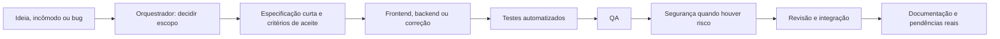

# Agentes de desenvolvimento do Atendara

Este fluxo organiza o trabalho da fase final e das próximas ideias do produto. A [arquitetura](ARCHITECTURE.md) e o [AGENTS.md](../AGENTS.md) continuam sendo as regras do repositório. Os oito papéis em `.claude/agents/` descrevem quem examina, implementa e valida cada tarefa. Eles não são agentes autônomos rodando continuamente e não substituem a Dara, que atua dentro do Atendara.

## Papéis

| Papel                | Quando usar                                                     | Entrega                                                       |
| -------------------- | --------------------------------------------------------------- | ------------------------------------------------------------- |
| `orchestrator`       | Toda demanda que envolve mais de uma etapa ou decisão de escopo | Decisão de produto, tarefa delimitada, integração e conclusão |
| `doc-writer`         | Ideia ainda vaga ou comportamento que mudou                     | Especificação ou documentação fiel ao código                  |
| `frontend-developer` | Tela, interação, acessibilidade                                 | Interface e evidência do fluxo                                |
| `backend-developer`  | Domínio, dados, Functions, Rules, integrações                   | Contrato e implementação com testes pertinentes               |
| `bug-fixer`          | Defeito reproduzível                                            | Causa, correção e regressão                                   |
| `test-engineer`      | Regra ou contrato que pede cobertura automática                 | Testes significativos e resultado dos comandos                |
| `qa-agent`           | Critérios de aceite prontos para validar                        | Parecer por cenário, com defeitos reproduzíveis               |
| `security-auditor`   | Mudança sensível ou revisão antes do piloto                     | Achados confirmados e priorizados                             |

QA valida o produto observado; o engenheiro de testes implementa a cobertura automática. A auditoria de segurança emite parecer independente. Isso evita que o mesmo agente declare sua própria mudança aprovada.

## Fluxo de uma demanda



O orquestrador primeiro escolhe com o titular se a função deve ser **mantida, melhorada, simplificada, retirada ou adiada**. Para as opções de retirada ou simplificação, descreve dependências, impacto em dados e caminho de migração antes de editar código. Uma ideia não entra no backlog de implementação só por existir.

Cada tarefa deve conter: problema e resultado desejado, decisão de escopo, critérios de aceite observáveis, áreas e arquivos prováveis, riscos, teste local e eventual validação real. Use uma tarefa pequena por comportamento. Se uma parte depende de decisão comercial, jurídica, fiscal ou do titular, marque a dependência explicitamente e avance apenas nas partes independentes.

O orquestrador pode distribuir investigação, frontend e backend em paralelo somente quando os arquivos e contratos estiverem separados. Teste, QA e auditoria recebem a versão integrada e identificável. Em trabalho no mesmo checkout, nunca há dois agentes escrevendo o mesmo arquivo. O agente principal confere o diff final e resolve conflitos; parecer de subagente não equivale a aprovação automática.

## Gates de conclusão

1. Critérios de aceite verificados; defeitos descobertos voltam ao `bug-fixer`.
2. Testes da área executados e, antes de PR, `npm run verify`.
3. Para mudança em Rules, Storage, acesso ou persistência, testes de emulador relevantes e revisão de segurança. `npm run test:emulator` cobre o conjunto local; escolha comandos específicos quando apropriado.
4. Documentação e `docs/VALIDACOES-REAIS-PENDENTES.md` atualizadas quando o comportamento ou o roteiro real mudar.
5. Dependências de credenciais, integrações reais, publicação e decisões do titular relatadas como pendentes, com evidência esperada. Não marque como concluído o que não foi testado.

## Como pedir trabalho

No Codex, peça ao agente principal: “Orquestre a melhoria da agenda: quero reduzir as opções de confirmação e manter os avisos somente com opt-in. Defina critérios, implemente, peça testes, QA e auditoria das partes sensíveis.” O agente principal lê estes papéis e delega subtarefas delimitadas quando o ambiente permite. Os arquivos `.claude/agents/*.md` são definições para ferramentas que reconhecem esse formato; não criam processos em segundo plano no Codex.

Para uma revisão de escopo sem código: “Mapeie a funcionalidade X como manter, simplificar ou retirar; mostre impacto e critérios antes de implementar.” Para defeito: “Reproduza X, corrija a causa e valide a regressão.”

O [repositório Curva Mestra](https://github.com/GScandelari/curva_mestra_system/tree/master/.claude/agents) inspirou a divisão de papéis. Os comandos, pastas e gates aqui usam o Atendara.

## Guia prático para o titular

### 1. Comece pelo resultado, não pelo nome do agente

Descreva o que incomoda, como você gostaria que funcionasse e o que considera excessivo. Informe uma tela, fluxo ou exemplo concreto. Não precisa conhecer arquivos ou tecnologias. Um pedido útil é:

> Na agenda, a confirmação tem opções demais. Quero confirmar um atendimento em poucos passos, sem enviar aviso ao cliente automaticamente. Examine o fluxo atual, proponha o que manter, simplificar ou retirar e mostre os critérios de aceite antes de alterar o comportamento.

Quando a decisão estiver clara, autorize a implementação na mesma conversa: “Implemente a opção escolhida, com testes, QA e revisão de segurança se houver impacto em consentimento.” Para tarefas já definidas, peça a implementação diretamente. O orquestrador deve avançar nas partes que não dependem de decisão sua.

### 2. Use estes gatilhos

| Situação que você observa                               | Pedido sugerido                                                                                                  | Papéis prováveis                                         |
| ------------------------------------------------------- | ---------------------------------------------------------------------------------------------------------------- | -------------------------------------------------------- |
| “Tenho uma ideia, mas ainda não sei se cabe no produto” | “Orquestre a avaliação da ideia X. Compare manter, simplificar, retirar e adiar; proponha o menor fluxo útil.”   | `orchestrator`, `doc-writer`                             |
| “A função ficou maior do que eu queria”                 | “Revise X como corte de escopo. Mostre dependências, dados afetados e o que desapareceria da tela.”              | `orchestrator`, depois especialistas necessários         |
| “A tela está confusa ou difícil de usar”                | “Melhore o fluxo X para o usuário Y, preservando as regras atuais. Valide teclado, foco e estados de erro.”      | `frontend-developer`, `qa-agent`                         |
| “Cliquei em X e ocorreu Y, mas esperava Z”              | “Reproduza esse bug, identifique a causa, corrija e cubra a regressão.”                                          | `bug-fixer`, `test-engineer`, `qa-agent`                 |
| “Preciso de uma integração ou regra nova”               | “Especifique o contrato de X, implemente o backend e cubra falhas, permissões e tenant.”                         | `backend-developer`, `test-engineer`, `security-auditor` |
| “Quero saber se já está bom para usar”                  | “Faça QA do fluxo X contra estes critérios, com dados fictícios, e separe falhas de validações reais pendentes.” | `qa-agent`; `security-auditor` se sensível               |
| “Mudamos o comportamento e a explicação está velha”     | “Atualize a documentação para refletir o código e os testes atuais de X.”                                        | `doc-writer`                                             |
| “Quero revisar riscos antes do piloto”                  | “Audite segurança do fluxo X no estado atual e traga achados com arquivo, linha, cenário e gravidade.”           | `security-auditor`                                       |

“Gatilho” aqui significa **um pedido seu ou uma condição da tarefa**. Não há disparo automático por palavras como “bug” ou “segurança”. O orquestrador escolhe os papéis necessários e pode executar uma tarefa pequena sozinho. Peça explicitamente “use subagentes para investigação independente” quando quiser acompanhar trabalho paralelo.

### 3. Escreva a tarefa em cinco campos

Copie e preencha apenas o que souber:

```text
Área: [tela ou fluxo]
Problema: [o que acontece hoje]
Resultado desejado: [o que deve acontecer]
Limite: [o que não quero, inclusive funções que devem sair]
Exemplo: [passos, imagem ou caso fictício]
```

Se não souber o resultado exato, diga “quero opções antes da implementação”. Se já decidiu, diga “implemente e valide”. Evite enviar dados pessoais reais, senhas e tokens; exemplos fictícios bastam para triagem e teste local.

### 4. Confira cada passagem

Na triagem, espere uma decisão de escopo, critérios de aceite e riscos. Na implementação, espere arquivos alterados e comportamento demonstrável. Nos testes, espere comandos e resultados. No QA, espere cenários aprovados, falhos, bloqueados ou não executados. Na auditoria, espere achados confirmados no código. Na conclusão, espere um resumo do que mudou e do que ainda depende de você.

Se o resultado fugir do que você imaginava, corrija o objetivo em linguagem de produto: “o usuário não deve ver essa opção” ou “este passo ainda é necessário”. O orquestrador ajusta a tarefa e chama novamente os papéis afetados. Uma falha de QA não é um aceite: volta para correção e nova validação.

### 5. Entenda o acionamento nas ferramentas

No **Codex**, converse com o agente principal neste projeto. `AGENTS.md` fornece as regras gerais, e o principal lê `.claude/agents/<papel>.md` para passar o papel a um subagente quando a sessão permite delegação. Dizer “orquestre X” pede a coordenação; dizer “use os papéis de QA e segurança” torna sua preferência explícita. Os arquivos Markdown não registram agentes permanentes nem iniciam tarefas sozinhos.

Em uma ferramenta que reconheça diretamente `.claude/agents/*.md`, esses mesmos arquivos podem aparecer como agentes selecionáveis. Confira as opções da ferramenta antes de assumir um comando específico. Em qualquer ambiente, trabalho paralelo deve ter limites claros e evitar escrita concorrente no mesmo arquivo.
